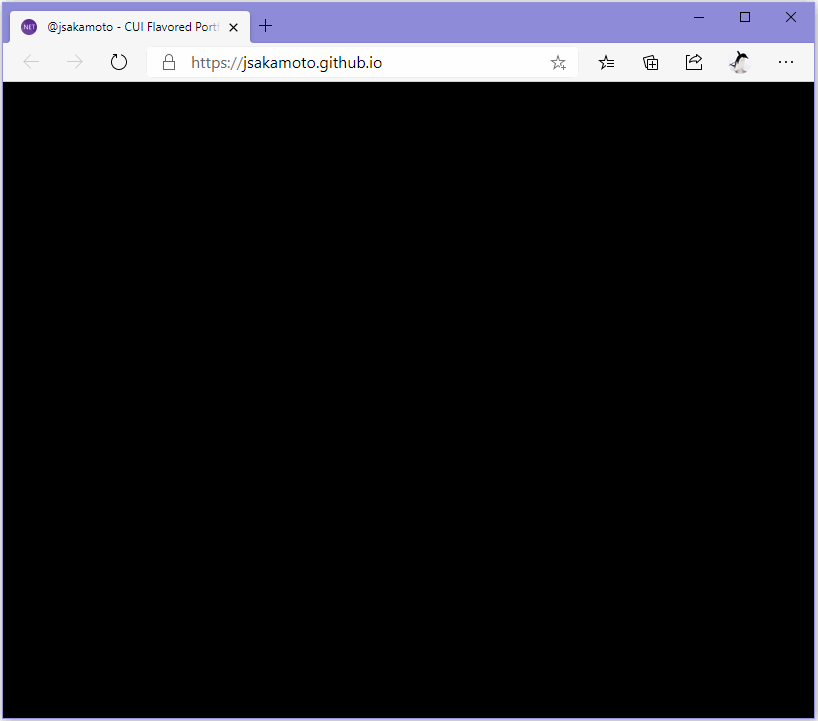

# CUI Flavored Portfolio Site about me - Powered by Blazor WebAssembly! 

## Summary

This is a portfolio site about me that is built on [Blazor WebAssembly](https://blazor.net).  
This site has a CUI flavored looks and user interface.

**The URL of the site is: https://jsakamoto.github.io/**

## Special Thanks

This project has been started after being inspired by [@AtriaSoft](https://twitter.com/AtriaSoft)'s [\"CUIPortfolio\"](https://github.com/Atria64/CUIPortfolio) project.

## License

[MIT License](LICENSE) ( [Third Party Notices](THIRD-PARTY-NOTICES.txt) )